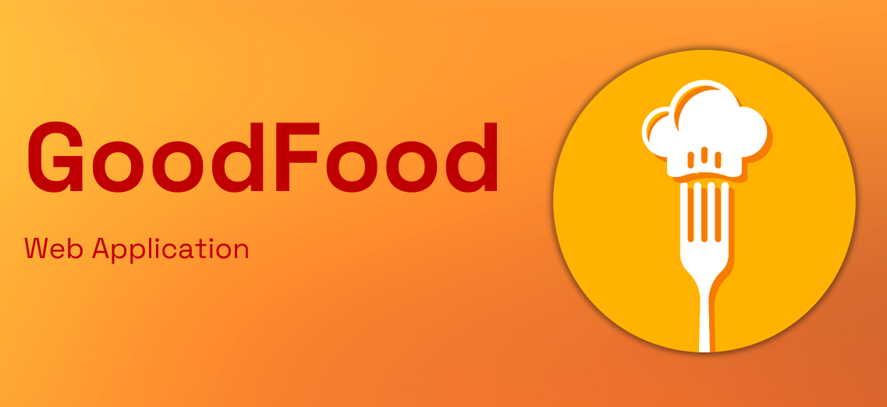
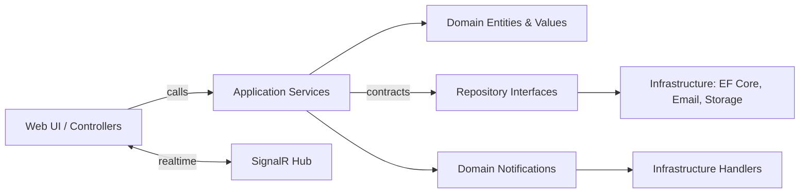
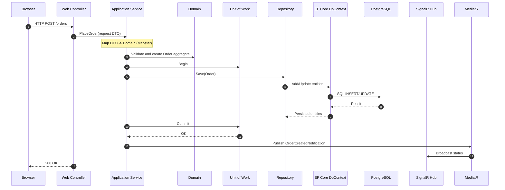

# GoodFood Developer Guide

## 🚀 Quick Start

**New to GoodFood?** Choose your preferred setup method:

- **🐳 [Docker Setup (Recommended)](README-SETUP.md#-setup-option-1-docker-recommended)** - One-click setup with containers
- **🛠️ [Manual Setup](README-SETUP.md#-setup-option-2-manual-local-development)** - Local development environment

📖 **[Complete Setup Guide](README-SETUP.md)** - Detailed instructions for both approaches

---

## Table of Contents

1. [Quick Start](#-quick-start) 🚀
2. [Overview](#1-overview)
3. [Architecture Summary](#2-architecture-summary)
4. [Clean Architecture & DDD](#3-clean-architecture--ddd-) (🧭)
5. [Tech Stack](#4-tech-stack-) (🧰)
6. [Mapping](#5-mapping-) (🗺️)
7. [Logging](#6-logging-) (🪵)
8. [Developer Guide](#7-developer-guide-) (🧑‍💻)
9. [Prerequisites](#8-prerequisites)
10. [Running Locally](#9-running-locally)
11. [Troubleshooting & Tips](#10-troubleshooting--tips)
12. [Contributing](#11-contributing-) (🤝)
13. [License](#12-license-) (📄)
14. [Credits](#13-credits-) (💜)

---

## 1. Overview

GoodFood is a modern, layered web application for food ordering, built with ASP.NET Core, Entity Framework Core, MediatR, and Blazor. It supports authentication, real-time updates, and background email processing.

## 2. Architecture Summary

- **Domain Layer**: Core business entities, value objects, repository contracts.
- **Application Layer**: Service contracts, business logic, MediatR handlers.
- **Infrastructure Layer**: Data access (EF Core), repository implementations, migrations, external integrations.
- **Web Layer**: ASP.NET Core web app (controllers, hubs, Razor/Blazor pages, services).
- **Worker.EmailSender**: Background worker for email notifications.
- **Tests**: Unit and integration tests.

### Key Technologies

- ASP.NET Core, EF Core, MediatR, Serilog, Mapster, Identity
- Docker for containerized deployment
- Blazor & Razor Pages for UI

---

## 3. Clean Architecture & DDD (🧭)

- **Entities (Domain) 🧱**: Business-centric types in `src/GoodFood.Domain/Entities` and value objects in `src/GoodFood.Domain/Values` encapsulate invariants and business rules.
- **Use Cases (Application) 🎯**: Application services in `src/GoodFood.Application/Services` orchestrate workflows and depend on domain contracts, not implementations. Interfaces live under `src/GoodFood.Application/Contracts`.
- **Infrastructure Adapters (Infrastructure) 🧩**: EF Core `DbContext`, repositories, migrations, and external services live in `src/GoodFood.Infrastructure`. They implement domain/application contracts.
- **Presentation (Web) 🖥️**: UI, controllers, SignalR hubs, and DI wiring reside in `src/GoodFood.Web`.
- **Bounded Contexts (DDD) 🗂️**: Ordering, Menu, Cart are separated in domain entities and repository contracts. Domain events (e.g., `OrderCreatedNotification`) decouple side effects from core flows.

Request flow (simplified):



Sequence: request to repository and database



Folder structure (abridged):

```text
src/
  GoodFood.Domain/           # 🧱 Domain: Entities, ValueObjects, Contracts
  GoodFood.Application/      # 🎯 Application: Services, Contracts, Mappers, Notifications
  GoodFood.Infrastructure/   # 🧩 Infrastructure: EF Core, Repos, DbContext, Migrations
  GoodFood.Web/              # 🖥️ Web: UI, Controllers, Hubs, DI
  GoodFood.Worker.EmailSender/ # ⚙️ Worker: background processing
tests/
  GoodFood.Tests/            # 🧪 Tests
```

Design principles:

- **Dependency Rule**: Outer layers depend inward. Only `Web` references `Infrastructure`; domain has no external dependencies.
- **Persistence Ignorance**: Entities are POCOs; EF mappings are isolated in `Infrastructure`.
- **Ubiquitous Language**: Types like `Order`, `Cart`, `Money`, `CustomerInfo` mirror business terms.

---

## 4. Tech Stack (🧰)

- **Runtime**: .NET 8
- **Web**: ASP.NET Core (Razor Pages + Server-side Blazor)
- **Persistence**: EF Core + PostgreSQL (`Npgsql` provider)
- **AuthN/Z**: ASP.NET Core Identity (custom `ApplicationUser`)
- **Messaging/Realtime**: SignalR (order status hub), NetMQ for internal push notifications
- **Mediators/Events**: MediatR for notifications (`OrderCreatedNotification` → handler)
- **Mapping**: Mapster (lightweight object mapping)
- **Logging**: Serilog (console sink; configurable via `appsettings.*.json`)
- **Observability**: Microsoft.Extensions.Telemetry (available for metrics/tracing)
- **Testing**: xUnit, Moq
- **Containers**: Docker (multi-stage build)

---

## 5. Mapping (🗺️)

- **Library**: Mapster
- **Global config**: Mappings are registered at startup, e.g. converting value objects like `Money` to primitives for serialization:

```csharp
// src/GoodFood.Web/Program.cs
TypeAdapterConfig<Money, decimal>.NewConfig().MapWith(src => src.Value);
```

- **Custom mappers**: Pure mapping helpers live under `src/GoodFood.Application/Mappers`:
  - `UserMapper` transforms authenticated user info into domain `CustomerInfo`.
  - `CartMapper` projects rich domain `Cart` into DTOs for UI.

Guidelines:

- Keep mapping logic deterministic and side-effect free.
- Map domain to DTOs at boundaries; pass domain types within use cases.

---

## 6. Logging (🪵)

- **Library**: Serilog
- **Bootstrap**: Logger is configured early in `Program.cs` and bound to configuration:

```csharp
// src/GoodFood.Web/Program.cs
builder.Host.UseSerilog((ctx, logger) => logger.ReadFrom.Configuration(ctx.Configuration));
```

- **Configuration**: Controlled via `appsettings.*.json` under `serilog`:

```json
// src/GoodFood.Web/appsettings.Development.json
{
  "serilog": {
    "MinimumLevel": {
      "Default": "Information",
      "Override": {
        "Microsoft.AspNetCore": "Warning",
        "Microsoft.EntityFrameworkCore.Database.Command": "Warning"
      }
    },
    "WriteTo": [ { "Name": "Console" } ]
  }
}
```

- **Sinks**: Console by default. Production can route to PostgreSQL or other sinks (example code present and can be enabled).
- **Usage**: Prefer structured logs with contextual properties; Serilog enrichers can be added as needed.

---

## 7. Developer Guide (🧑‍💻)

- **Local DB**: PostgreSQL (via Docker or local install). Update `ConnectionStrings:DefaultConnection` in `src/GoodFood.Web/appsettings.*.json`.
- **Migrations**:
  - Add: `dotnet ef migrations add <Name> --project src/GoodFood.Infrastructure`
  - Update: `dotnet ef database update --project src/GoodFood.Infrastructure`
- **Run**:
  - Web: `dotnet run --project src/GoodFood.Web`
  - Worker: `dotnet run --project src/GoodFood.Worker.EmailSender`
- **Tests**: `dotnet test tests/GoodFood.Tests`
- **Debugging**:
  - Enable detailed errors via `appsettings.Development.json` → `DetailedErrors: true`.
  - Serilog console sink is enabled in Development.
- **Coding Standards**:
  - C# 12, nullable enabled, analyzers configured centrally (`Directory.Build.props`).
  - Prefer domain types internally; map to DTOs at boundaries.
  - Keep services/application layer free of EF Core types.
- **Branching & Commits**:
  - Branches: `feature/<short-description>`, `fix/<short-description>`
  - Conventional commits: `feat:`, `fix:`, `docs:`, `refactor:`, `test:`, `chore:`
- **PR Checklist**:
  - Tests passing, updated docs, no analyzer errors, migrations included when schema changes.

---

## 8. Prerequisites

- [.NET 8 SDK](https://dotnet.microsoft.com/download)
- [Docker Desktop](https://www.docker.com/products/docker-desktop)
- (Optional) SQL Server or PostgreSQL (if not using Docker)
- (Optional) Node.js (for front-end asset management)

---

## 9. Running Locally

> 📖 **For complete setup instructions with troubleshooting, see the [Complete Setup Guide](README-SETUP.md)**

### Quick Setup Options

#### 🐳 Docker (Recommended)
```bash
# Windows
setup-and-run.bat

# Linux/macOS
chmod +x setup-and-run.sh && ./setup-and-run.sh
```
Access at: http://localhost:8090

#### 🛠️ Manual/Local Development
```bash
# Windows
setup-manual.bat

# Linux/macOS  
chmod +x setup-manual.sh && ./setup-manual.sh
```
Access at: https://localhost:7001 or http://localhost:5000

### What You Need

**For Docker Setup:**
- Docker Desktop
- .NET 8.0 SDK

**For Manual Setup:**
- .NET 8.0 SDK
- PostgreSQL 12+
- Database: `goodfood_db_pub`

### Environment Configurations

| Setup Type | Environment | Database Host | Database Password | Access Port |
|------------|-------------|---------------|-------------------|-------------|
| Docker | Staging | `db` (container) | `postgres` | 8090 |
| Manual | Development | `localhost` | `postgres` | 5000/7001 |

---

## 10. Troubleshooting & Tips

> 🔧 **For detailed troubleshooting, see the [Complete Setup Guide](README-SETUP.md#-troubleshooting)**

### Quick Fixes

- **Database Connection Issues**: Ensure PostgreSQL is running and credentials match your environment
- **Port Conflicts**: Check if ports 8090 (Docker) or 5000/7001 (Manual) are available
- **Migration Errors**: Verify .NET 8.0 SDK is installed and project builds successfully
- **Docker Issues**: Ensure Docker Desktop is running and containers are healthy

### Common Commands

```bash
# Check .NET version
dotnet --version

# Build project
dotnet build src/GoodFood.Web/GoodFood.Web.csproj

# Run migrations
dotnet ef database update --project src/GoodFood.Infrastructure --startup-project src/GoodFood.Web

# Check Docker containers
docker ps

# View application logs
docker-compose logs webapp
```

---

## 11. Contributing (🤝)

- **Issues**: Open a descriptive issue with steps to reproduce or a proposal.
- **Fork & Branch**: Fork the repo and create a feature branch.
- **Code Style**: Follow the analyzers; ensure `dotnet format` is clean.
- **Tests**: Add/adjust unit tests in `tests/GoodFood.Tests`.
- **PRs**: Submit a PR linked to an issue, with a clear description and screenshots/logs where helpful.

See `CONTRIBUTING.md` for details.

---

## 12. License (📄)

This project is licensed under the MIT License. See the `LICENSE` file for details.

---

## 13. Credits (💜)

Developed by [codehaks.com](https://codehaks.com).

- **Ports**: If ports are busy, change them in `docker-compose.yml` or `appsettings.json`.
- **Database Issues**: Ensure migrations are applied and connection strings are correct.
- **Front-End Assets**: If using Node.js, run `npm install` and `npm run build` in the relevant directories.
- **Logs**: Check Serilog output in the console for errors.
- **Tests**: Run tests with:

  ```sh
  dotnet test tests/GoodFood.Tests
  ```

