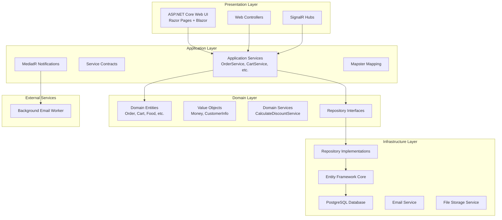

# GoodFood Architecture Analysis

## 🏗️ Overall Architecture Overview

GoodFood is a monolithic ASP.NET Core web application implementing Clean Architecture principles with Domain-Driven Design (DDD) patterns. The application follows a layered architecture with clear separation of concerns.

### 📊 Current Architecture Diagram



## 🎯 Architecture Assessment

### ✅ Strengths

1. **Clean Architecture Compliance**
   - Clear layer separation with dependency inversion
   - Domain layer has no external dependencies
   - Infrastructure depends on domain abstractions

2. **Domain-Driven Design Implementation**
   - Rich domain entities with business logic (`Order`, `Cart`)
   - Value objects for concepts like `Money`
   - Repository pattern for data access abstraction

3. **Technology Stack**
   - Modern .NET 8 runtime
   - Entity Framework Core for ORM
   - PostgreSQL for reliable data storage
   - SignalR for real-time updates
   - MediatR for decoupling notifications

4. **Separation of Concerns**
   - Business logic encapsulated in domain entities
   - Application services orchestrate workflows
   - Infrastructure handles external concerns

### ⚠️ Areas for Improvement

1. **Domain Model Completeness**
   - Limited use of aggregate roots
   - Missing domain events for complex business scenarios
   - Insufficient validation and business rule enforcement

2. **Testing Coverage**
   - Minimal unit tests (only `CartTests` and `MoneyTests`)
   - No integration tests visible
   - Missing architecture tests to enforce boundaries

3. **Error Handling**
   - Basic exception handling in services
   - No centralized error handling strategy
   - Limited validation and error responses

4. **Performance Considerations**
   - No caching strategy implemented
   - Potential N+1 query issues
   - No performance monitoring

## 📋 Current Project Structure

```
src/
├── GoodFood.Domain/           # 🏛️ Core business logic
│   ├── Entities/             # Domain entities
│   ├── Values/               # Value objects
│   ├── Contracts/            # Repository interfaces
│   └── Common/               # Base classes
├── GoodFood.Application/      # 🎯 Application services
│   ├── Services/             # Application logic
│   ├── Contracts/            # Service interfaces
│   ├── Models/               # DTOs and view models
│   └── Notifications/        # MediatR notifications
├── GoodFood.Infrastructure/   # 🔧 External concerns
│   ├── Persistence/          # EF Core & repositories
│   ├── Services/             # External service implementations
│   └── NotificationHandlers/ # Event handlers
├── GoodFood.Web/             # 🌐 Presentation layer
│   ├── Areas/                # Feature-based organization
│   ├── Controllers/          # Web API controllers
│   ├── Hubs/                 # SignalR hubs
│   └── Services/             # Web-specific services
└── GoodFood.Worker.EmailSender/ # 📧 Background processing
```

## 🔄 Request Flow Analysis

### Typical Order Placement Flow
1. **User Interface** (Razor Page/Blazor) captures order request
2. **Controller** receives HTTP request and calls application service
3. **Application Service** (`OrderService`) orchestrates the business operation
4. **Domain Entity** (`Order`) applies business rules and validation
5. **Repository** persists changes through Unit of Work pattern
6. **MediatR Notification** triggers email sending
7. **SignalR Hub** broadcasts real-time updates to clients

### Data Flow Patterns
- **Command Pattern**: Application services handle commands
- **Repository Pattern**: Abstract data access
- **Unit of Work**: Ensure transaction consistency
- **Event-Driven**: MediatR for cross-cutting concerns

## 🏷️ Bounded Contexts

Current bounded contexts identified:
- **Ordering Context**: Order management and processing
- **Menu Context**: Food items and categories
- **Cart Context**: Shopping cart functionality
- **User Context**: Customer information and authentication

## 🎬 Technology Stack Analysis

### Core Technologies
- **Runtime**: .NET 8 (Modern and well-supported)
- **Web Framework**: ASP.NET Core (Industry standard)
- **Database**: PostgreSQL (Robust and scalable)
- **ORM**: Entity Framework Core (Feature-rich)

### Supporting Libraries
- **Mapping**: Mapster (Lightweight and fast)
- **Logging**: Serilog (Structured logging)
- **Authentication**: ASP.NET Core Identity
- **Real-time**: SignalR (Built-in support)
- **Messaging**: MediatR (In-process messaging)

### Deployment
- **Containerization**: Docker support with docker-compose
- **Database Migrations**: EF Core migrations
- **Configuration**: ASP.NET Core configuration system

## 🎯 Architecture Maturity Assessment

| Aspect | Current Level | Target Level | Gap Analysis |
|--------|---------------|--------------|--------------|
| Clean Architecture | ⭐⭐⭐ | ⭐⭐⭐⭐⭐ | Missing aggregate roots, domain events |
| DDD Implementation | ⭐⭐⭐ | ⭐⭐⭐⭐⭐ | Limited ubiquitous language, missing complex aggregates |
| Testing Strategy | ⭐⭐ | ⭐⭐⭐⭐⭐ | Minimal coverage, no integration/architecture tests |
| Error Handling | ⭐⭐ | ⭐⭐⭐⭐⭐ | Basic exceptions, no global strategy |
| Performance | ⭐⭐ | ⭐⭐⭐⭐⭐ | No caching, monitoring, or optimization |
| Documentation | ⭐⭐⭐ | ⭐⭐⭐⭐⭐ | Good README, missing API docs |

## 🔮 Next Steps

The current architecture provides a solid foundation but requires enhancement in several key areas:

1. **Domain Model Enhancement** - Strengthen aggregate design and business rules
2. **Testing Strategy** - Implement comprehensive testing at all layers  
3. **Performance Optimization** - Add caching and monitoring
4. **Error Handling** - Implement global error handling strategy
5. **Documentation** - Add API documentation and architectural decision records

See [`improvement-roadmap.md`](./improvement-roadmap.md) for detailed implementation steps.
