# Testing Strategy Analysis

## 🧪 Current Testing Implementation

### Test Project Structure
```
tests/GoodFood.Tests/
├── Domain/
│   └── UnitTests/
│       ├── CartTests.cs      # ✅ Domain entity tests
│       └── MoneyTests.cs     # ✅ Value object tests
├── Web/
│   ├── BannedWordCheckerTests.cs    # ✅ Service tests
│   ├── EmailSenderTests.cs          # ✅ Infrastructure tests
│   └── FoodImagePathServiceTests.cs # ✅ Service tests
├── GlobalUsings.cs          # Global test imports
└── GoodFood.Tests.csproj    # Test project configuration
```

## 📊 Test Coverage Assessment

### ✅ Current Strengths

1. **Domain Testing Foundation**
   - `CartTests.cs`: Comprehensive cart business logic testing
   - `MoneyTests.cs`: Value object behavior validation
   - Proper use of xUnit framework
   - Good test naming conventions

2. **Service Layer Testing**
   - Web service components tested
   - Infrastructure service testing (email)
   - Mock usage for external dependencies

3. **Test Quality**
   - Clear Arrange-Act-Assert structure
   - Meaningful test names
   - Good edge case coverage in domain tests

### ⚠️ Critical Gaps

#### 1. **Missing Test Types**

| Test Type | Current Status | Coverage | Priority |
|-----------|----------------|----------|----------|
| Unit Tests | ⭐⭐⭐ | Domain entities only | High |
| Integration Tests | ❌ Missing | 0% | Critical |
| Architecture Tests | ❌ Missing | 0% | High |
| End-to-End Tests | ❌ Missing | 0% | Medium |
| Performance Tests | ❌ Missing | 0% | Medium |

#### 2. **Layer Coverage Gaps**

```mermaid
graph TB
    subgraph "Test Coverage by Layer"
        Domain[Domain Layer<br/>⭐⭐⭐⭐ 40%]
        Application[Application Layer<br/>❌ 0%]
        Infrastructure[Infrastructure Layer<br/>⭐⭐ 20%]
        Web[Web Layer<br/>⭐⭐ 20%]
    end
    
    Domain --> |Tested| DomainTests[Cart, Money]
    Application --> |Missing| AppTests[Services, Mappings]
    Infrastructure --> |Partial| InfraTests[Email Only]
    Web --> |Partial| WebTests[Helper Services]
```



## 🎯 Detailed Test Analysis

### Domain Layer Tests (Good Foundation)

#### `CartTests.cs` - Well Implemented ✅
```csharp
[Fact]
public void New_Line_Is_Added_to_CartLines()
{
    // Arrange
    var customer = new CustomerInfo("1", "u");
    var cart = new Cart(customer, timeProvider);
    var cartLine = new CartLine { FoodId = 1, Quantity = 1, Price = 10.0M };
    
    // Act
    cart.AddOrUpdate(cartLine);
    
    // Assert
    Assert.Single(cart.Lines);
    Assert.Equal(1, cart.Lines[0].FoodId);
}
```

**Strengths:**
- ✅ Tests business logic behavior
- ✅ Clear test structure
- ✅ Good edge case coverage
- ✅ Proper mocking of `TimeProvider`

#### `MoneyTests.cs` - Value Object Testing ✅
- Tests value object immutability
- Validates business rules (negative values)
- Tests operator overloads

### Missing Critical Tests

#### 1. Application Service Tests ❌
```csharp
// Missing: OrderService tests
public class OrderServiceTests
{
    [Fact]
    public async Task PlaceAsync_ValidCart_ReturnsOrderId()
    {
        // Test order placement logic
        // Verify discount calculation
        // Check unit of work transactions
    }
    
    [Fact]
    public async Task PlaceAsync_EmptyCart_ThrowsException()
    {
        // Test business rule validation
    }
}
```

#### 2. Repository Integration Tests ❌
```csharp
// Missing: Repository integration tests
public class OrderRepositoryIntegrationTests : IClassFixture<DatabaseFixture>
{
    [Fact]
    public async Task SaveOrder_ComplexOrder_PersistsCorrectly()
    {
        // Test EF Core mapping
        // Verify database constraints
        // Check transaction rollback
    }
}
```

#### 3. Architecture Tests ❌
```csharp
// Missing: Architecture constraint tests
public class ArchitectureTests
{
    [Fact]
    public void Domain_Should_Not_Reference_Infrastructure()
    {
        // Verify dependency rules
    }
    
    [Fact]
    public void Controllers_Should_Only_Reference_Application_Layer()
    {
        // Verify clean architecture compliance
    }
}
```

## 🚀 Testing Strategy Recommendations

### Phase 1: Fill Critical Gaps (High Priority)

#### 1. Application Layer Testing
```csharp
// Recommended test structure
tests/GoodFood.Tests/
├── Application/
│   ├── Services/
│   │   ├── OrderServiceTests.cs
│   │   ├── CartServiceTests.cs
│   │   └── MenuServiceTests.cs
│   ├── Mappers/
│   │   └── UserMapperTests.cs
│   └── Notifications/
│       └── OrderCreatedNotificationTests.cs
```

#### 2. Integration Testing Infrastructure
```csharp
// Database test fixture
public class DatabaseFixture : IDisposable
{
    public GoodFoodDbContext Context { get; }
    
    public DatabaseFixture()
    {
        var options = new DbContextOptionsBuilder<GoodFoodDbContext>()
            .UseInMemoryDatabase(Guid.NewGuid().ToString())
            .Options;
        Context = new GoodFoodDbContext(options);
    }
}
```

#### 3. Architecture Testing
```csharp
// Using NetArchTest library
[Fact]
public void Domain_Should_Not_Have_Dependencies()
{
    var result = Types.InAssembly(typeof(Order).Assembly)
        .Should()
        .NotHaveDependencyOn("Microsoft.EntityFrameworkCore")
        .GetResult();
        
    Assert.True(result.IsSuccessful);
}
```

### Phase 2: Enhanced Testing (Medium Priority)

#### 1. End-to-End Testing
```csharp
// Using ASP.NET Core Test Host
public class OrderPlacementIntegrationTests : IClassFixture<WebApplicationFactory<Program>>
{
    [Fact]
    public async Task PlaceOrder_CompleteFlow_Success()
    {
        // Test complete order placement flow
        // From cart creation to order confirmation
    }
}
```

#### 2. Performance Testing
```csharp
// Using NBomber or similar
[Fact]
public void OrderService_PlaceOrder_PerformanceTest()
{
    // Test service performance under load
    // Verify response times
}
```

### Phase 3: Advanced Testing (Lower Priority)

#### 1. Contract Testing
- API contract tests for external consumers
- Database schema migration tests
- SignalR hub contract testing

#### 2. Chaos Engineering
- Database connectivity failure tests
- External service timeout scenarios
- Memory pressure testing

## 🛠️ Recommended Testing Tools

### Current Stack (Keep)
- **xUnit**: Excellent test framework for .NET
- **Moq**: Good mocking framework (already in use)

### Additional Tools to Add

#### 1. Test Infrastructure
```xml
<PackageReference Include="Microsoft.AspNetCore.Mvc.Testing" Version="8.0.0" />
<PackageReference Include="Microsoft.EntityFrameworkCore.InMemory" Version="8.0.0" />
<PackageReference Include="Testcontainers.PostgreSql" Version="3.0.0" />
```

#### 2. Architecture Testing
```xml
<PackageReference Include="NetArchTest.Rules" Version="1.3.2" />
```

#### 3. Coverage Analysis
```xml
<PackageReference Include="coverlet.msbuild" Version="6.0.0" />
<PackageReference Include="ReportGenerator" Version="5.1.0" />
```

#### 4. Performance Testing
```xml
<PackageReference Include="NBomber" Version="5.0.0" />
<PackageReference Include="BenchmarkDotNet" Version="0.13.0" />
```

## 📋 Testing Implementation Roadmap

### Sprint 1: Foundation (1-2 weeks)
- [ ] Set up integration test infrastructure
- [ ] Add missing application service tests
- [ ] Implement architecture tests
- [ ] Configure test coverage reporting

### Sprint 2: Repository & Infrastructure (1 week)
- [ ] Add repository integration tests
- [ ] Test EF Core mapping and migrations
- [ ] Add infrastructure service tests
- [ ] Test MediatR notification pipeline

### Sprint 3: Web Layer & E2E (1-2 weeks)
- [ ] Add controller integration tests
- [ ] Test SignalR hub functionality
- [ ] Implement end-to-end test scenarios
- [ ] Add API contract tests

### Sprint 4: Performance & Quality (1 week)
- [ ] Add performance tests for critical paths
- [ ] Implement mutation testing
- [ ] Set up automated test reporting
- [ ] Create test documentation

## 🎯 Testing Quality Gates

### Minimum Acceptable Coverage
- **Unit Tests**: 80% coverage for domain and application layers
- **Integration Tests**: 90% coverage for critical user journeys
- **Architecture Tests**: 100% compliance with clean architecture rules

### CI/CD Integration
```yaml
# GitHub Actions / Azure DevOps
- name: Run Tests
  run: dotnet test --collect:"XPlat Code Coverage"
  
- name: Architecture Tests
  run: dotnet test --filter Category=Architecture

- name: Generate Coverage Report
  run: reportgenerator -reports:**/coverage.cobertura.xml -targetdir:coverage
```

### Test Metrics to Track
- Code coverage percentage
- Test execution time
- Architecture rule violations
- Performance benchmark results
- Flaky test detection

## 🎪 Testing Best Practices

### 1. Test Naming Convention
```csharp
// Pattern: MethodName_Scenario_ExpectedBehavior
[Fact]
public void PlaceOrder_WithValidCart_ReturnsOrderId() { }

[Fact] 
public void PlaceOrder_WithEmptyCart_ThrowsInvalidOperationException() { }
```

### 2. Test Organization
- Group related tests in same class
- Use nested classes for logical grouping
- Implement proper test fixtures for shared setup

### 3. Mock Strategy
- Mock external dependencies
- Don't mock domain entities
- Use concrete implementations for value objects

### 4. Data Management
- Use test data builders for complex objects
- Implement database seeding for integration tests
- Clean up test data between tests

This testing strategy will significantly improve code quality, reduce bugs, and provide confidence for future refactoring and feature development.
