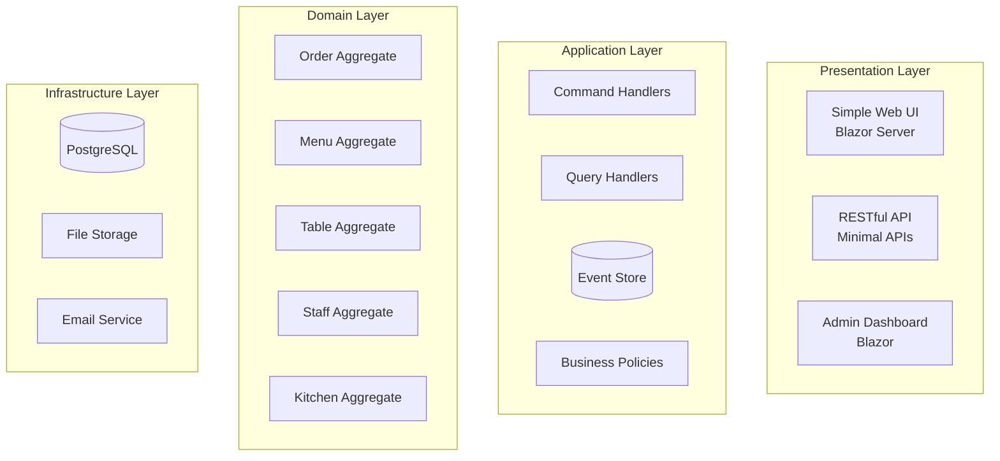

# 🍽️ TastePoint v2 - Single Restaurant DDD-First Application

**TastePoint v2** is a complete rewrite of the food ordering system, designed from scratch with Domain-Driven Design (DDD) and Clean Architecture as the foundation. Built specifically for mid-size single restaurants with simplified UI and enhanced business logic.

## 🎯 Vision

Create a **domain-centric**, **business-focused** food ordering platform that truly reflects the restaurant's operational needs through rich domain modeling and clean architectural boundaries.

## 📋 V2 Documentation Structure

- [`domain-analysis.md`](./domain-analysis.md) - Deep domain modeling and bounded contexts
- [`architecture-blueprint.md`](./architecture-blueprint.md) - Clean Architecture implementation plan
- [`tech-stack.md`](./tech-stack.md) - Technology decisions and rationale
- [`implementation-roadmap.md`](./implementation-roadmap.md) - Development phases and priorities
- [`ui-ux-vision.md`](./ui-ux-vision.md) - Simplified UI/UX design principles

## 🎪 Key Differentiators from v1

### Domain-Driven Approach
- **Rich Domain Models** with embedded business logic
- **Proper Aggregates** with strong consistency boundaries  
- **Domain Events** for all business operations
- **Ubiquitous Language** throughout the codebase

### Clean Architecture Excellence
- **Hexagonal Architecture** implementation
- **Dependency Inversion** at every layer
- **Port & Adapter** pattern for external integrations
- **Command/Query Separation** (CQRS)

### Restaurant-Centric Features
- **Table Management** with real-time availability
- **Kitchen Workflow** optimization
- **Staff Role Management** with permissions
- **Inventory Integration** with low-stock alerts

## 🏗️ High-Level Architecture



## 🚀 Quick Start

```bash
# Clone and setup TastePoint v2
git clone [repository]
cd tastepoint-v2
dotnet run --project src/TastePoint.Web
```

See [`implementation-roadmap.md`](./implementation-roadmap.md) for detailed development phases and [`tech-stack.md`](./tech-stack.md) for complete technology choices.
