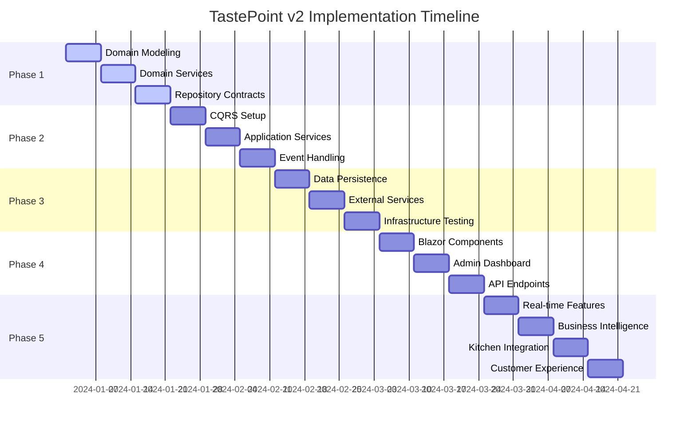

# TastePoint v2 - Implementation Roadmap

## 🎯 Development Phases Overview

### Phase Distribution
- **Phase 1**: Domain Foundation (Weeks 1-3) - 🔴 **Critical Priority**
- **Phase 2**: Application Layer (Weeks 4-6) - 🔴 **Critical Priority**  
- **Phase 3**: Infrastructure Implementation (Weeks 7-9) - 🟡 **High Priority**
- **Phase 4**: Presentation Layer (Weeks 10-12) - 🟡 **High Priority**
- **Phase 5**: Advanced Features (Weeks 13-16) - 🟢 **Medium Priority**

## 📊 Timeline Overview



---

## 🔴 **Phase 1: Domain Foundation (Weeks 1-3)**
**Priority: Critical | Effort: High | Risk: Low**

### Week 1: Core Domain Modeling
**Goal: Establish rich domain aggregates with business logic**

#### Day 1-2: Project Structure & Base Classes
- [ ] Create solution structure following Clean Architecture
- [ ] Implement `AggregateRoot<T>` base class with domain events
- [ ] Create `Entity<T>` and `ValueObject` base classes
- [ ] Setup `IDomainEvent` infrastructure
- [ ] Configure project dependencies and analyzers

```csharp
// Deliverables
public abstract class AggregateRoot<T> : Entity<T>
{
    private readonly List<IDomainEvent> _domainEvents = new();
    public IReadOnlyCollection<IDomainEvent> DomainEvents => _domainEvents.AsReadOnly();
    
    protected void AddDomainEvent(IDomainEvent domainEvent)
    {
        _domainEvents.Add(domainEvent);
    }
    
    public void ClearDomainEvents() => _domainEvents.Clear();
}
```

#### Day 3-4: Order Aggregate Implementation
- [ ] Implement `Order` aggregate root with all business rules
- [ ] Create `OrderItem` entity with validation
- [ ] Implement order status transitions with business logic
- [ ] Add order placement, confirmation, and completion flows
- [ ] Write comprehensive unit tests for order business logic

#### Day 5-7: Core Value Objects
- [ ] Implement `Money` value object with currency support
- [ ] Create `Quantity`, `TableNumber`, `SpecialInstructions` value objects
- [ ] Implement `OrderStatus`, `TableStatus` enumerations
- [ ] Add value object equality and validation logic
- [ ] Unit test all value objects thoroughly

### Week 2: Domain Services & Policies
**Goal: Implement domain services and business policies**

#### Day 1-3: Domain Services
- [ ] Implement `PricingService` for order total calculations
- [ ] Create `KitchenWorkflowService` for preparation time estimates
- [ ] Implement `TableAllocationService` for optimal table assignment
- [ ] Add `InventoryService` for menu item availability
- [ ] Write unit tests for all domain services

#### Day 4-5: Business Policies
- [ ] Implement `OrderPolicy` for order validation rules
- [ ] Create `TablePolicy` for table assignment rules
- [ ] Add `PricingPolicy` for dynamic pricing logic
- [ ] Implement `KitchenPolicy` for preparation workflow rules

#### Day 6-7: Domain Events
- [ ] Define all domain events (OrderPlaced, TableOccupied, etc.)
- [ ] Implement event metadata and timestamps
- [ ] Create event serialization contracts
- [ ] Add domain event unit tests

### Week 3: Repository Contracts & Aggregates
**Goal: Complete domain layer with repository interfaces**

#### Day 1-2: Repository Interfaces
- [ ] Define `IOrderRepository` with all query methods
- [ ] Create `ITableRepository` for table management
- [ ] Implement `IMenuRepository` for menu operations
- [ ] Add `IUnitOfWork` for transaction management

#### Day 3-4: Menu & Table Aggregates
- [ ] Implement `Menu` aggregate with item management
- [ ] Create `Table` aggregate with reservation logic
- [ ] Add `MenuItem` entity with availability tracking
- [ ] Implement menu category management

#### Day 5-7: Domain Exceptions & Validation
- [ ] Create custom domain exceptions hierarchy
- [ ] Implement business rule validation
- [ ] Add input validation for all value objects
- [ ] Complete domain layer testing (>95% coverage)

**Week 3 Deliverables:**
- Complete domain layer with rich aggregates
- All business rules implemented and tested
- Repository contracts defined
- Domain events infrastructure ready

---

## 🔴 **Phase 2: Application Layer (Weeks 4-6)**
**Priority: Critical | Effort: High | Risk: Medium**

### Week 4: CQRS Infrastructure
**Goal: Establish command/query separation with MediatR**

#### Day 1-2: MediatR Setup
- [ ] Configure MediatR dependency injection
- [ ] Create command and query base interfaces
- [ ] Implement validation pipeline behavior
- [ ] Setup logging and performance monitoring pipeline

#### Day 3-4: Command Definitions
- [ ] Define all order commands (Place, Confirm, Cancel, etc.)
- [ ] Create table management commands
- [ ] Implement menu management commands
- [ ] Add command validation attributes

#### Day 5-7: Query Definitions
- [ ] Define order queries with DTOs
- [ ] Create table status queries
- [ ] Implement menu browsing queries
- [ ] Add pagination and filtering support

### Week 5: Application Services Implementation
**Goal: Implement core application services using CQRS**

#### Day 1-2: Order Command Handlers
- [ ] Implement `PlaceOrderCommandHandler` with full business logic
- [ ] Create `ConfirmOrderCommandHandler`
- [ ] Add `CancelOrderCommandHandler` with compensation logic
- [ ] Implement order status transition handlers

#### Day 3-4: Order Query Handlers
- [ ] Implement `GetOrderDetailsQueryHandler`
- [ ] Create `GetActiveOrdersQueryHandler`
- [ ] Add `GetOrderHistoryQueryHandler`
- [ ] Implement order statistics queries

#### Day 5-7: Table & Menu Services
- [ ] Implement table management command handlers
- [ ] Create menu management handlers
- [ ] Add table availability queries
- [ ] Implement menu browsing with filtering

### Week 6: Event Handling & Policies
**Goal: Implement event-driven architecture and policies**

#### Day 1-3: Domain Event Handlers
- [ ] Implement `OrderPlacedEventHandler` for kitchen notifications
- [ ] Create `TableOccupiedEventHandler` for status updates
- [ ] Add `MenuItemUnavailableEventHandler`
- [ ] Implement cross-aggregate event coordination

#### Day 4-5: Application Policies
- [ ] Implement order validation policies
- [ ] Create table assignment optimization policies
- [ ] Add pricing calculation policies
- [ ] Implement notification policies

#### Day 6-7: Integration Testing
- [ ] Setup application layer integration tests
- [ ] Test command/query handlers with real dependencies
- [ ] Validate event handling flows
- [ ] Performance test critical paths

**Week 6 Deliverables:**
- Complete CQRS implementation
- All application services tested
- Event handling infrastructure working
- Application policies implemented

---

## 🟡 **Phase 3: Infrastructure Implementation (Weeks 7-9)**
**Priority: High | Effort: Medium | Risk: Medium**

### Week 7: Data Persistence Layer
**Goal: Implement EF Core persistence with event store**

#### Day 1-2: EF Core Setup
- [ ] Configure DbContext with all entities
- [ ] Implement entity configurations and mappings
- [ ] Create database migrations
- [ ] Setup connection string management

#### Day 3-4: Repository Implementations
- [ ] Implement `OrderRepository` with complex queries
- [ ] Create `TableRepository` with availability tracking
- [ ] Implement `MenuRepository` with caching
- [ ] Add `UnitOfWork` implementation

#### Day 5-7: Event Store Integration
- [ ] Setup EventStore DB connection
- [ ] Implement event serialization/deserialization
- [ ] Create event store repository
- [ ] Add event replay capabilities

### Week 8: External Services Integration
**Goal: Implement external service adapters**

#### Day 1-2: Email Service
- [ ] Implement SMTP email service with templates
- [ ] Create email queue for reliability
- [ ] Add email template management
- [ ] Implement email delivery tracking

#### Day 3-4: File Storage Service
- [ ] Implement file storage abstraction
- [ ] Add local file storage for development
- [ ] Create Azure Blob storage for production
- [ ] Implement file upload validation

#### Day 5-7: Caching & Performance
- [ ] Implement Redis caching layer
- [ ] Add query result caching
- [ ] Implement session state management
- [ ] Setup performance monitoring

### Week 9: Infrastructure Testing & Optimization
**Goal: Ensure infrastructure reliability and performance**

#### Day 1-3: Integration Testing
- [ ] Setup Testcontainers for database testing
- [ ] Create repository integration tests
- [ ] Test event store operations
- [ ] Validate caching behavior

#### Day 4-5: Performance Optimization
- [ ] Database query optimization
- [ ] Add database indexing strategy
- [ ] Implement connection pooling
- [ ] Cache warming strategies

#### Day 6-7: Monitoring & Logging
- [ ] Setup structured logging with Serilog
- [ ] Implement health checks
- [ ] Add application metrics
- [ ] Configure error tracking

**Week 9 Deliverables:**
- Complete data persistence layer
- All external services integrated
- Infrastructure fully tested
- Performance optimized and monitored

---

## 🟡 **Phase 4: Presentation Layer (Weeks 10-12)**
**Priority: High | Effort: Medium | Risk: Low**

### Week 10: Blazor Components Development
**Goal: Create interactive UI components**

#### Day 1-2: Base Components
- [ ] Create base layout and navigation
- [ ] Implement authentication components
- [ ] Add shared UI components (buttons, forms, etc.)
- [ ] Setup Tailwind CSS styling

#### Day 3-4: Order Management UI
- [ ] Create order placement form
- [ ] Implement order status tracking
- [ ] Add order history display
- [ ] Real-time order updates with SignalR

#### Day 5-7: Menu & Table Management
- [ ] Implement menu browsing interface
- [ ] Create table status dashboard
- [ ] Add table assignment interface
- [ ] Real-time table status updates

### Week 11: Admin Dashboard
**Goal: Build comprehensive admin interface**

#### Day 1-3: Restaurant Management
- [ ] Create menu item management interface
- [ ] Implement table configuration
- [ ] Add staff management features
- [ ] Restaurant settings configuration

#### Day 4-5: Kitchen Dashboard
- [ ] Create kitchen order display
- [ ] Implement order preparation workflow
- [ ] Add preparation time tracking
- [ ] Kitchen staff task management

#### Day 6-7: Analytics & Reporting
- [ ] Implement sales dashboard
- [ ] Create performance metrics display
- [ ] Add customer analytics
- [ ] Generate operational reports

### Week 12: API Endpoints & Integration
**Goal: Complete REST API for external integrations**

#### Day 1-2: Core API Endpoints
- [ ] Implement order management APIs
- [ ] Create table management endpoints
- [ ] Add menu browsing APIs
- [ ] API authentication and authorization

#### Day 3-4: API Documentation
- [ ] Setup Swagger/OpenAPI documentation
- [ ] Add API examples and schemas
- [ ] Create API testing collection
- [ ] Implement API versioning

#### Day 5-7: Integration & Testing
- [ ] End-to-end testing of all features
- [ ] API integration testing
- [ ] UI component testing
- [ ] Performance testing

**Week 12 Deliverables:**
- Complete Blazor Server application
- Admin dashboard fully functional
- REST API documented and tested
- End-to-end user workflows working

---

## 🟢 **Phase 5: Advanced Features (Weeks 13-16)**
**Priority: Medium | Effort: Medium | Risk: Low**

### Week 13: Real-time Features Enhancement
**Goal: Enhance real-time capabilities**

#### Day 1-3: SignalR Hub Development
- [ ] Implement order status broadcasting
- [ ] Create kitchen display real-time updates
- [ ] Add table status notifications
- [ ] Customer notification system

#### Day 4-5: Live Dashboard
- [ ] Real-time sales metrics
- [ ] Live kitchen performance indicators
- [ ] Table turnover tracking
- [ ] Staff productivity metrics

#### Day 6-7: Mobile Optimization
- [ ] Responsive design improvements
- [ ] Touch-optimized interfaces
- [ ] Offline capability for critical features
- [ ] Progressive Web App setup

### Week 14: Business Intelligence & Analytics
**Goal: Add advanced analytics and reporting**

#### Day 1-3: Sales Analytics
- [ ] Revenue tracking and forecasting
- [ ] Popular items analysis
- [ ] Peak hours identification
- [ ] Customer behavior analytics

#### Day 4-5: Operational Analytics
- [ ] Kitchen efficiency metrics
- [ ] Table utilization analysis
- [ ] Staff performance tracking
- [ ] Order fulfillment analytics

#### Day 6-7: Predictive Analytics
- [ ] Demand forecasting
- [ ] Inventory optimization suggestions
- [ ] Staffing recommendations
- [ ] Revenue optimization insights

### Week 15: Kitchen Integration & Workflow
**Goal: Optimize kitchen operations**

#### Day 1-3: Kitchen Display System
- [ ] Order queue optimization
- [ ] Preparation time tracking
- [ ] Kitchen station management
- [ ] Recipe and instruction display

#### Day 4-5: Inventory Integration
- [ ] Real-time inventory tracking
- [ ] Low stock alerts
- [ ] Automatic reorder suggestions
- [ ] Waste tracking and reporting

#### Day 6-7: Staff Management
- [ ] Role-based permissions
- [ ] Shift scheduling integration
- [ ] Performance tracking
- [ ] Training module integration

### Week 16: Customer Experience & Polish
**Goal: Enhance customer experience and final polish**

#### Day 1-3: Customer Features
- [ ] Loyalty program implementation
- [ ] Order history and favorites
- [ ] Personalized recommendations
- [ ] Feedback and rating system

#### Day 4-5: Performance Optimization
- [ ] Final performance tuning
- [ ] Security hardening
- [ ] Error handling improvements
- [ ] Code quality improvements

#### Day 6-7: Deployment & Documentation
- [ ] Production deployment setup
- [ ] User training documentation
- [ ] Administrative guides
- [ ] Final testing and validation

**Week 16 Deliverables:**
- Complete feature-rich application
- Advanced analytics and reporting
- Optimized kitchen workflows
- Production-ready deployment

---

## 🚀 Quick Wins Implementation (Can Start Immediately)

### Week 1 Immediate Tasks (2-3 days each)
1. **Project Structure Setup**
   ```bash
   # Create solution and projects
   dotnet new sln -n TastePoint
   dotnet new classlib -n TastePoint.Domain
   dotnet new classlib -n TastePoint.Application
   dotnet new classlib -n TastePoint.Infrastructure
   dotnet new blazorserver -n TastePoint.Web
   ```

2. **Money Value Object** (High Value, Low Effort)
   ```csharp
   public class Money : ValueObject
   {
       public decimal Value { get; }
       public Currency Currency { get; }
       // Implementation with operators and validation
   }
   ```

3. **Basic Order Aggregate** (Foundation for Everything)
   ```csharp
   public class Order : AggregateRoot<OrderId>
   {
       // Core business logic for order management
   }
   ```

4. **Development Environment** (Essential Infrastructure)
   ```yaml
   # docker-compose.dev.yml with PostgreSQL, Redis, EventStore
   ```

5. **Basic Testing Infrastructure** (Quality Foundation)
   ```xml
   <!-- Test project with xUnit, FluentAssertions, Testcontainers -->
   ```

## 📊 Success Metrics & Quality Gates

### Phase Completion Criteria

#### Phase 1 (Domain) - Quality Gates:
- [ ] **Test Coverage**: >95% for domain layer
- [ ] **Architecture Tests**: All dependency rules enforced
- [ ] **Business Rules**: All documented rules implemented
- [ ] **Code Quality**: A-grade SonarQube rating

#### Phase 2 (Application) - Quality Gates:
- [ ] **Test Coverage**: >90% for application layer
- [ ] **Performance**: All commands <100ms average
- [ ] **CQRS**: Clear command/query separation
- [ ] **Validation**: All inputs validated

#### Phase 3 (Infrastructure) - Quality Gates:
- [ ] **Integration Tests**: All repositories tested
- [ ] **Performance**: Database queries <50ms average
- [ ] **Reliability**: All external services have fallbacks
- [ ] **Monitoring**: Full observability implemented

#### Phase 4 (Presentation) - Quality Gates:
- [ ] **User Experience**: All workflows tested
- [ ] **Performance**: Page loads <2 seconds
- [ ] **Accessibility**: WCAG AA compliance
- [ ] **Mobile**: Responsive design verified

#### Phase 5 (Advanced) - Quality Gates:
- [ ] **Real-time**: <500ms update latency
- [ ] **Analytics**: All KPIs implemented
- [ ] **Performance**: Load tested to target capacity
- [ ] **Documentation**: Complete user guides

### Business Value Metrics
- **Order Processing Time**: <30 seconds from placement to kitchen
- **Table Turnover**: 20% improvement in utilization
- **Staff Efficiency**: 40% reduction in order errors
- **Customer Satisfaction**: <5 minute average service time
- **Revenue Impact**: 15% increase in orders per hour

This roadmap provides a structured approach to building TastePoint v2 with clear milestones, deliverables, and quality gates to ensure successful delivery of a production-ready restaurant management system.
