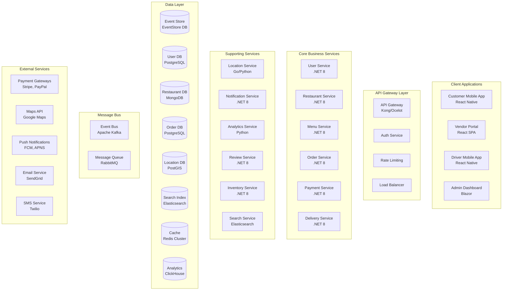

# 🌟 FoodHub v3 - Multi-Vendor Microservices Platform

**FoodHub v3** is a comprehensive, microservices-based food delivery platform supporting multiple vendors with a crowdsourced delivery network. Built for scale, reliability, and global reach.

## 🎯 Vision

Create a **scalable**, **multi-tenant**, **event-driven** food delivery ecosystem that can handle thousands of restaurants and millions of orders with real-time tracking and intelligent delivery optimization.

## 📋 V3 Documentation Structure

- [`microservices-architecture.md`](./microservices-architecture.md) - Service decomposition and boundaries
- [`domain-contexts.md`](./domain-contexts.md) - Bounded contexts and domain modeling
- [`tech-stack-microservices.md`](./tech-stack-microservices.md) - Technology stack for distributed systems
- [`deployment-strategy.md`](./deployment-strategy.md) - Kubernetes, cloud-native deployment
- [`api-design.md`](./api-design.md) - API gateway, service communication patterns
- [`data-strategy.md`](./data-strategy.md) - Polyglot persistence and event sourcing
- [`delivery-network.md`](./delivery-network.md) - Crowdsourced delivery system design
- [`scalability-roadmap.md`](./scalability-roadmap.md) - Growth phases and optimization

## 🎪 Key Features

### Multi-Vendor Platform
- **Restaurant Onboarding** with automated verification
- **Vendor Management** with analytics and insights
- **Commission Management** with flexible pricing models
- **Brand Customization** for each restaurant

### Crowdsourced Delivery
- **Driver Registration** with background checks
- **Intelligent Routing** with AI-powered optimization
- **Real-time Tracking** for all stakeholders
- **Dynamic Pricing** based on demand and distance

### Enterprise Features
- **Multi-tenant Architecture** with data isolation
- **Global Scalability** with region-specific deployments
- **Advanced Analytics** with real-time dashboards
- **Payment Processing** with multiple gateway support

## 🏗️ Microservices Architecture



## 🚀 Getting Started

### Local Development
```bash
# Start infrastructure services
docker-compose -f docker-compose.dev.yml up -d

# Start all microservices
./scripts/start-services.sh

# Access services
curl http://localhost:8080/api/v1/restaurants
```

### Kubernetes Deployment
```bash
# Deploy to Kubernetes
kubectl apply -f k8s/namespace.yaml
helm install foodhub ./helm/foodhub -n foodhub-production

# Access API Gateway
kubectl port-forward svc/api-gateway 8080:80 -n foodhub-production
```

## 📊 Service Overview

### Core Services (Business Critical)

| Service | Responsibility | Technology | Database |
|---------|---------------|------------|----------|
| **User Service** | Authentication, profiles | .NET 8 | PostgreSQL |
| **Restaurant Service** | Vendor management | .NET 8 | MongoDB |
| **Menu Service** | Food catalog | .NET 8 | MongoDB + Redis |
| **Order Service** | Order lifecycle | .NET 8 | PostgreSQL + EventStore |
| **Payment Service** | Payment processing | .NET 8 | PostgreSQL |
| **Delivery Service** | Driver management, routing | .NET 8 | PostGIS |

### Supporting Services

| Service | Responsibility | Technology | Database |
|---------|---------------|------------|----------|
| **Location Service** | Geospatial operations | Go/Python | PostGIS |
| **Notification Service** | Multi-channel messaging | .NET 8 | Redis |
| **Analytics Service** | Business intelligence | Python | ClickHouse |
| **Search Service** | Full-text search | Elasticsearch | Elasticsearch |
| **Review Service** | Ratings and reviews | .NET 8 | PostgreSQL |

## 🌍 Multi-Region Architecture

### Global Deployment Strategy
```
Americas Region (Primary)
├── US East (Virginia) - Primary
├── US West (California) - Secondary
└── Canada Central - Edge

Europe Region
├── EU West (Ireland) - Primary
├── EU Central (Frankfurt) - Secondary
└── UK South - Edge

Asia Pacific Region
├── AP Southeast (Singapore) - Primary
├── AP Northeast (Tokyo) - Secondary
└── Australia East - Edge
```

### Data Replication Strategy
- **User Data**: Global replication with GDPR compliance
- **Restaurant Data**: Regional with cross-region backup
- **Order Data**: Region-specific with audit trail replication
- **Analytics Data**: Aggregated globally for insights

## 🔧 Development Workflow

### Service Development
```bash
# Create new service from template
./scripts/create-service.sh MyNewService

# Run service locally
cd services/mynewservice
dotnet run --environment Development

# Run tests
dotnet test

# Build and push container
docker build -t foodhub/mynewservice:latest .
docker push foodhub/mynewservice:latest
```

### Integration Testing
```bash
# Start test environment
docker-compose -f docker-compose.test.yml up -d

# Run integration tests
dotnet test --configuration Integration

# Run end-to-end tests
npm run test:e2e
```

## 📈 Scalability & Performance

### Expected Load Capacity
- **Concurrent Users**: 1M+ active users
- **Orders per Second**: 10,000+ peak throughput
- **Database Operations**: 100,000+ ops/sec
- **Message Processing**: 1M+ events/sec
- **Geographic Coverage**: Global multi-region

### Auto-scaling Configuration
```yaml
# Horizontal Pod Autoscaler
apiVersion: autoscaling/v2
kind: HorizontalPodAutoscaler
metadata:
  name: order-service-hpa
spec:
  scaleTargetRef:
    apiVersion: apps/v1
    kind: Deployment
    name: order-service
  minReplicas: 3
  maxReplicas: 100
  metrics:
  - type: Resource
    resource:
      name: cpu
      target:
        type: Utilization
        averageUtilization: 70
  - type: Resource
    resource:
      name: memory
      target:
        type: Utilization
        averageUtilization: 80
```

## 🛡️ Security & Compliance

### Security Features
- **OAuth 2.0 / OpenID Connect** authentication
- **JWT tokens** with rotation
- **API rate limiting** and DDoS protection
- **End-to-end encryption** for sensitive data
- **PCI DSS compliance** for payment processing
- **GDPR compliance** for data privacy

### Monitoring & Observability
- **Distributed tracing** with Jaeger
- **Metrics collection** with Prometheus
- **Log aggregation** with ELK stack
- **Real-time alerting** with PagerDuty
- **Service mesh** with Istio

See individual documentation files for detailed implementation guides, technology choices, and deployment strategies.
